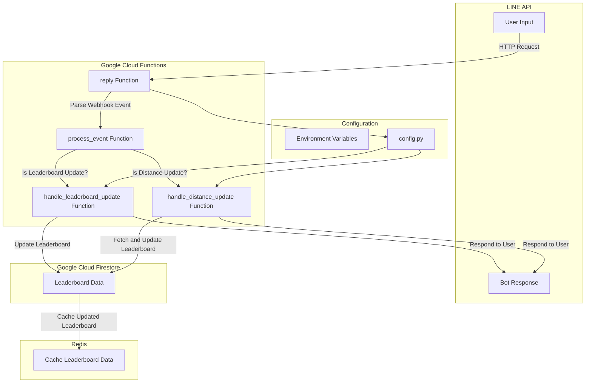

# Intania 92 Runner Bot
  [](https://sonarcloud.io/summary/new_code?id=naveen-pit_intania92-runner-bot) [](https://sonarcloud.io/summary/new_code?id=naveen-pit_intania92-runner-bot)


LINE Bot for Running Challenge Leaderboard in LINE group

## Overview
This project is a LINE bot designed to manage and update a running challenge leaderboard. The bot listens to messages, parses input data, updates the leaderboard with running distances, and returns updated leaderboard standings. It is built using Flask, Google Cloud Firestore, and LINE Messaging API.



## Features
- **Leaderboard Management:** The bot can initialize and update the leaderboard based on user inputs.
- **Distance Updates:** Users can add running distances which are then reflected in the leaderboard.
- **Month Change Detection:** Automatically detects when a new month begins and updates the leaderboard accordingly.
- **Firestore Integration:** All leaderboard data is stored and retrieved using Google Cloud Firestore.

# Project Structure
```plaintext
.
├── main.py               # Main entry point for the application
├── cloud_interface.py    # Interfaces for handling google cloud operations
├── config.py             # Configuration file for setting up project-specific settings
├── google_cloud.py       # Google Cloud Firestore and Secret client setup
├── utils.py              # Utility functions for date handling and month changes
├── cloudbuild.yaml       # Google Cloud Build configuration for deployment
├── Makefile              # Makefile for setting up and running the project
└── README.md             # Project documentation
```

## Installation

1. Clone the repository:

```bash
git clone https://github.com/yourusername/line-bot-leaderboard.git
```

2. Install the required dependencies:

```bash
pip install -r requirements.txt
```

3. Set up your environment variables by creating a `.env` file in the project root or setting the environment variables directly. The variables are prefixed with `LINEBOT_` and include:

- `LINEBOT_LINE_CHANNEL_SECRET_KEY`
- `LINEBOT_LINE_ACCESS_TOKEN`
- `LINEBOT_PROJECT_ID`

Example `.env` file:

```env
LINEBOT_LINE_CHANNEL_SECRET_KEY="your_secret_key"
LINEBOT_LINE_ACCESS_TOKEN="your_access_token"
LINEBOT_PROJECT_ID="your_project_id"
```

## Configuration
The configuration is managed through the config.py file using Pydantic settings. The RunSetting class in this file allows for easy configuration of all the parameters required by the bot.

**Configuration Fields**
- **line_channel_secret_key:** The secret key for the LINE channel.
- **line_access_token:** The access token for the LINE bot.
- **firestore_database:** The Firestore database name for storing leaderboard data.
- **firestore_leaderboard_collection:** The Firestore collection name for the leaderboard.
- **project_id:** The Google Cloud Project ID. If not specified, it will attempt to use the default project ID - associated with your Google Cloud credentials.

## Deployment
### Deploying to Google Cloud Functions
This project includes a cloudbuild.yaml file that automates the deployment process to Google Cloud Functions. To deploy, follow these steps:

1. Ensure you have the Google Cloud SDK installed and authenticated to your project.

2. Use the following command to trigger a deployment:

```bash
gcloud builds submit --config cloudbuild.yaml
```
3. Ensure following permission are granted
- allUsers are accessible the cloud function with `Cloud Functions Invoker` role.
- Service account of the cloud function has granted to Firebase

The `cloudbuild.yaml` file is configured to deploy the function to the `asia-southeast1` region, use Python 3.11 runtime, and set the necessary secrets for LINE API integration.

## Cloud Build Configuration (cloudbuild.yaml)
```yaml
steps:
- name: 'gcr.io/google.com/cloudsdktool/cloud-sdk'
  args:
  - gcloud
  - functions
  - deploy
  - intania92-runner-bot
  - --no-gen2
  - --region=asia-southeast1
  - --trigger-http
  - --source=running_bot/.
  - --entry-point=reply
  - --memory=512MB
  - --runtime=python311
  - --set-secrets=LINEBOT_LINE_ACCESS_TOKEN=line-channel-access-token:latest,LINEBOT_LINE_CHANNEL_SECRET_KEY=line-channel-secret:latest
options:
  logging: CLOUD_LOGGING_ONLY
```
This configuration deploys the function with the specified settings and secrets.

## Development
### Setting Up the Project Locally
This project uses `Poetry` for dependency management and includes a `Makefile` for setup and running the project.

**Installing Poetry**
To install Poetry and set up the project:

```bash
make install_poetry_zsh
```
This command installs Poetry, configures shell completions for Zsh, and verifies the installation.

**Linting and Testing**
To lint the code and run tests:

```bash
make lint
make test
```

The `lint` target runs `black`, `ruff`, and `mypy` to check code formatting, linting, and type checking. The `test` target runs tests using pytest with coverage reporting.

**Running Locally**
To run the project locally for development:

```bash
make run_local
```
This command starts the Flask development server on port 8000.

If you want to expose your local development server for external access (e.g., for testing with the LINE webhook), you can use ngrok:

```bash
make ngrok
```
